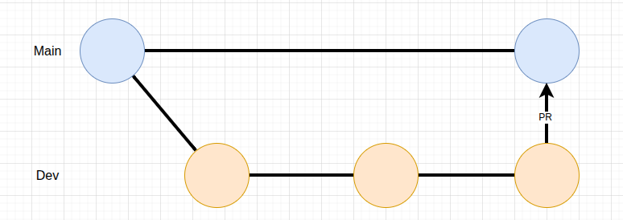
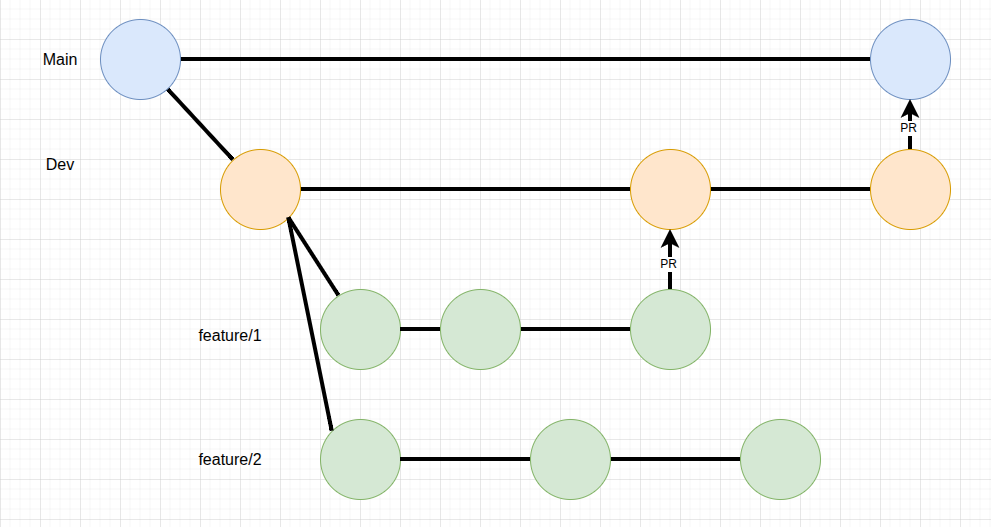
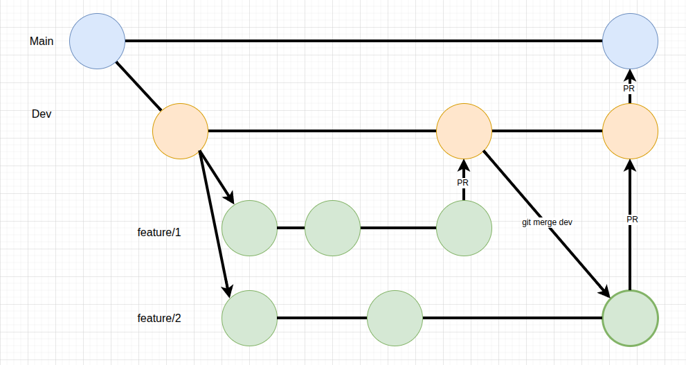

## GitFlow: правила работы с ветками

### Общая логика

1. Основная стабильная ветка — `main`.  
	В ней всегда лежит **проверенный и готовый к продакшену** код.  
	Вливать в неё можно **только через Pull Request (PR) из `dev`**.
	
	
2. Рабочая ветка разработки — **`dev`**.  
	Все новые задачи, фичи и исправления делаются **из `dev`** и вливаются **обратно в `dev`** через PR.
	
	Прямые коммиты в `dev` запрещены (но, допускаются в ряде исключительных случаев)
3. Ветки фич называются по шаблону:
	```
	feature/some-feature-name
	```

---

### Создание новой ветки

Перед началом работы всегда убедиться, что у тебя свежий `dev`:
```shell
git checkout dev
git pull origin dev
```

Теперь создаем новую ветку из `dev`:
```shell
git checkout -b feature/your-feature-name
```

Работаем, коммитим изменения:
```shell
git add .
git commit -m "feat: add some feature"
```

Отправляем ветку в репозиторий:
```shell
git push -u origin feature/your-feature-name
```

---

## Как влить изменения

Когда фича готова:

1. Открой **Pull Request (PR)** из своей ветки (`feature/...`) → в `dev`.
2. Дождись **ревью и одобрения**.
3. После одобрения PR мёржится в `dev`.

---

## Обновление ветки dev

Когда несколько фич уже смержены, можно обновить `dev` и потом — `main`.

1. Убедись, что у тебя последняя версия `dev`:
```shell
git checkout dev
git pull origin dev
```
2. Открой **PR из `dev` → в `main`**.  
	После ревью и тестирования код вливается в `main`.

---

## Регулярное обновление своей ветки

Чтобы избежать конфликтов, **регулярно подтягивай изменения из `dev`:**
```shell
git checkout dev
git pull origin dev
git checkout feature/your-feature-name
git merge dev
```


Если появились конфликты — реши их, протестируй код и сделай новый коммит:
```shell
git add .
git commit -m "fix: resolve merge conflicts with dev"
```

---

## Чего не делаем

Не коммитим напрямую в `dev` или `main`.  
Не создаём ветки от `main`.  
Не вливаем ничего без PR.
